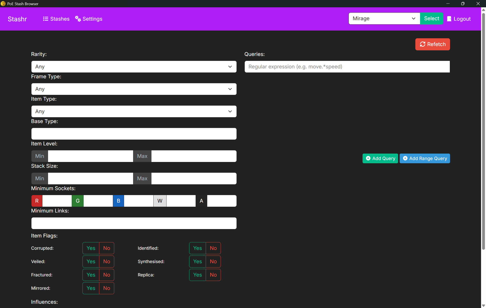

# PoE Stash Browser

This is a cross-platform desktop utility designed to take the role of the legacy "Acquisition" stash search application for the game Path of Exile. It allows you to search through all of your stash tabs at once to find a specific item.

## Features

- Uses modern Path of Exile OAuth API
- Search for mods using regular expressions
- AND, OR, and NOT modifiers for queries
- Range queries (e.g. "Movement Speed >= 30%")
- Grid and list view of results

## Roadmap

- Improve rate limit handling for faster fetches
- Save/load search queries
- Highlight mod on item that matched query
- Auto-refresh search every X seconds
